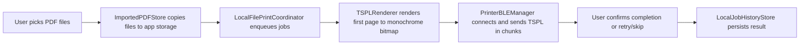

# Architecture

## Overview

BluetoothPrinterApp is a standalone SwiftUI iOS application that prints PDF
labels to BLE thermal printers using TSPL commands.

## High-level flow

## Main components

- `Sources/App`: app entry and tab navigation.
- `Sources/Printer`: BLE connection, printer discovery, settings, TSPL rendering.
- `Sources/Queue`: local file import, queue orchestration, history storage.
- `Sources/Shared`: toast feedback UI.

## Data and persistence

- Imported PDF files are copied into app-managed Application Support storage.
- Print settings persist to `print_settings.json`.
- Print history persists to `print_history.json`.
- Queue uses an in-memory dictionary mapping `jobID -> localFileURL`.

## Non-goals

- No backend order-management or warehouse modules.
- No printer status query protocol (manual/timeout confirmation model).
